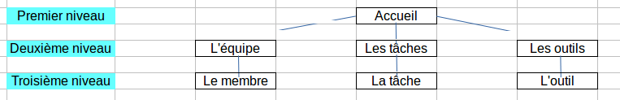

# Présentation de l'entreprise

L'entreprise _Ben & Fils_ est une entreprise de services à la personne.
Depuis sa création, l'entreprise n'a fait qu'augmenter son personnel et diversifier ses activités.

# Besoin

Pour pouvoir continuer à grandir, l'entreprise veut se doter d'une infrastructure avec laquelle elle pourra gérer les tâches de ses employés.
Le site ne sera accessible qu'en interne et doit faire grandement progresser l'équipe encadrante dans le management de son équipe.
Les commanditaires insistent sur la robustesse du système.
Il sera composé de :
* Une base de données contenant les données
* Une interface de consultation de ces données selon différents critères
* Un système de gestion d'articles

# Ergonomie

## Couleur

Le site devra être très facile à prendre en main et le plus intuitif possible : les décideurs ne veulent pas perdre de temps en formation, une documentation approfondie leur suffira.

couleur | hexa
--- | ---
principale | #e37222
secondaire | #07889b
tertiaire | #66b9bf
supplémentaire | #eeaa7b

# Plan du site

# Contexte

Dans l'entreprise _Ben & Fils_, chacun des employés libres se voit affecter une tâche ainsi que des outils nécessaires pour la réalisation de cette tâche.

# Description fonctionnelle

Sur toutes les pages, doivent être présents :

* le menu
* le logo ainsi que le nom de l'entreprise

## Accueil

* Accès rapide aux 3 rubriques différentes
* Affichage des 2 **articles** *les plus récents* type blog en première page

## L'équipe

Une liste de tous les équipiers
Il sera ici visible si un employé est occupé à réaliser une tâche (ou surmené) ou s'il est disponible

### Le membre

Une vue détaillée du membre avec toutes les tâches qu'il a effectuées
Il sera ajouté divers indicateurs pour savoir si l'employé est surmené :
* Si un ouvrier fait plus de 50% de tâches pénibles
* Si un ouvrier fait plus de tâches que de raison
* Si un ouvrier est occupé

## Les tâches

Une liste de toutes les tâches
Il sera ici visible si une tâche est terminée ou non, son état d'avancement...

### La tâche

Une vue détaillée de la tâche avec tous les outils requis et l'ouvrier sélectionné s'il a été choisi.
Il sera possible d'affecter un ouvrier à une tâche
Si la tâche est en train d'être réalisée, on veut voir le taux d'avancement.
De plus, il sera possible de laisser un commentaire à propos de la tâche.

## Les outils

Une liste de tous les outils
Il sera ici visible si un outil est utilisé

### L'outil

Une vue détaillée de l'outil

# Contraintes

* Un menu permettant de naviguer entre toutes les pages de niveau 2 et pouvant ramener à l'accueil
* Fonctionnement OK sous IE > 8, Chrome > 20, Firefox > 4, Opera > 10, Safari > 6
